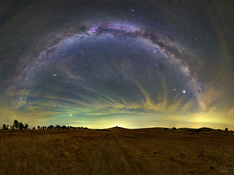

# eInk Radiator Image Source: Image


Generates an image from the [NASA Image of the Day](https://www.nasa.gov/multimedia/imagegallery/iotd.html).

```bash
nasa-image-of-the-day generate --config config.json --height 300 --width 400
```

It's based around the [APOD API](https://github.com/nasa/apod-api) and requires an API key from NASA.

## Configuration

The configuration only requires a [NASA API key](https://api.nasa.gov/), but can also specify a date to pick a specific day.

| field  | default | required | description |
|--------|---------|----------|-------------|
| apiKey |         | Yes      | The NASA API key |
| date   |         | No       | A date, in YYYY-MM-DD format, of a specific day to fetch |

## Examples

```yaml
---
apiKey: <redacted>
date: "2022-04-18"
```


